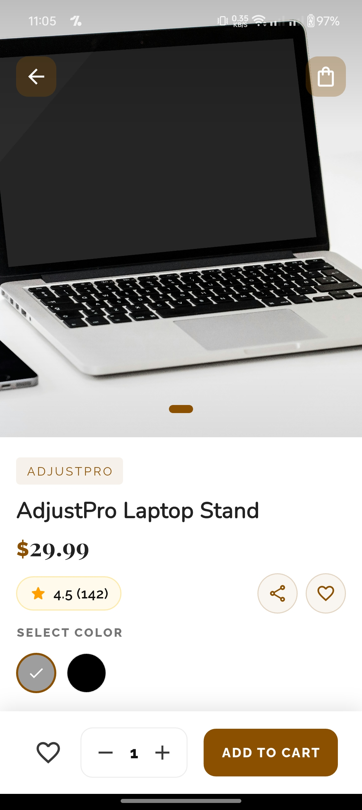

# Hermes Harbor ✨  

Hermes Harbor is a luxury fashion e-commerce app built with Flutter, featuring premium UI designs, smooth animations, and Riverpod state management. While currently a UI prototype, it showcases a complete shopping experience with product browsing, cart management, and checkout flows.

[](https://flutter.dev)
[](https://riverpod.dev)

<p align="center">
  
  
  
</p>

## Features  

### 🛍️ **Core Shopping Experience**
- **Product Browsing**: Grid and list views with elegant animations
- **Product Details**: High-fidelity screens with image galleries
- **Cart Management**: Persistent cart using SharedPreferences
- **Checkout Flow**: Multi-step process with address/payment options

### 🎨 **Design Highlights**
- **Micro-Interactions**:  
  - Hero animations for product transitions  
  - Animated route transitions  
  - Physics-based scrolling effects  

### ⚙️ **Technical Implementation**
- **State Management**: Riverpod with providers for all business logic
- **Persistent Cart**: Local storage via SharedPreferences
- **UI Toolkit**: Custom design system with reusable components

---

## Screens  

<p align="center">  
    
    
</p> 

---

## 🛠️ Technical Stack  

### **Frontend**
- **Framework**: Flutter 3.19  
- **State Management**: Riverpod  
- **Animations**:  
  - `flutter_animate` for micro-interactions  
  - Custom physics animations  
- **Persistence**: SharedPreferences (Cart data)  

### **UI Components**
- Custom sliver app bars with gradient effects  
- Responsive product cards with hover states  
- Animated bottom sheets for filters  
- Page transition animations using `PageTransitionSwitcher`

---

## 🎥 Animation Showcase  

```dart
// Example of product card animation
ProductCard(
  product: product,
).animate()
  .fadeIn(duration: 300.ms)
  .slideY(begin: 0.1, curve: Curves.easeOutQuart);
```

<p align="center">
  
</p>

---

## 🚀 Getting Started  

1. Clone the repository:
   ```bash
   https://github.com/theprantadutta/hermes_harbor_flutter_app.git
   ```

2. Install dependencies:
   ```bash
   flutter pub get
   ```

3. Run the app:
   ```bash
   flutter run
   ```

---

## 📝 Project Status  

**Current Phase**: UI Prototype  
**Next Steps**:  
- [ ] Integrate with mock API service  
- [ ] Implement user authentication  
- [ ] Add payment gateway simulator  

---

## 📄 License  

This project is licensed under the MIT License - see the [LICENSE](LICENSE) file for details.